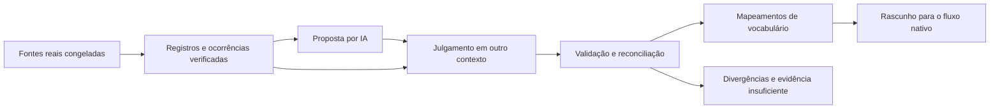

# Qualificação linguística por IA

O fluxo automatiza a preparação e a revisão de vocabulário usando fontes verificáveis. A IA propõe a interpretação dos registros; outra execução confere as propostas contra os mesmos trechos. Os resultados são rascunhos identificados como avaliações de máquina, com decisões aproveitáveis e uma fila de dúvidas. Nenhum campo dos cards muda.

A [entrega do piloto completo](machine-pilot-completion.md) documenta as revisões dirigidas, as correções por ocorrência, os dez conteúdos PT, a execução limitada de áudio e os comandos de expansão por idioma.



## O que é automatizado

- O pipeline verifica arquivos e análises por SHA-256, preserva sementes e fontes, calcula medidas e prepara pacotes. A coleta remota continua usando os comandos catalogados de aquisição e corpus descritos no [guia de qualificação](linguistic-qualification.md).
- A exportação em lotes cobre todos os itens dos pacotes, preservando a ligação com o pacote original. Por padrão, acrescenta os contextos verificados disponíveis e os detalhes lexicais a novos pacotes. Retomar o mesmo pedido verifica os arquivos já produzidos; mudança de entrada exige outra saída.
- A proposta lexical contém lema, classe, sentido proposto, gloss e citações. A revisão de formas contém decisão de importância e notas justificadas. A revisão de casos permite tokens com offsets exatos.
- O julgamento usa outra execução/contexto e confere a proposta contra as fontes. Modelo, origem, horário e consumo conhecido ficam registrados fora da resposta do modelo. Quando a identidade exata do modelo é desconhecida, permanece `null`.
- A reconciliação separa acordo, rejeição, dúvida e divergência. O relatório HTML é local, sem scripts, serviços externos ou campos secretos.
- O rascunho mantém os mapeamentos de IA e entrega um `VocabularyReview` pendente, compatível com o fluxo existente. Correções não alteram os registros originais. Recibos humanos, qualificação nativa e decisões de redistribuição continuam explícitos.

## Registros, ocorrências e importância

Um registro linguístico descreve uma entrada de fonte: por exemplo, **comer**, verbo, com um sentido e suas formas. Uma ocorrência é um trecho real de corpus com posição exata: em “Nós comemos cedo”, o sistema registra onde aparece “comemos”, seu lema e sua análise, junto da origem.

A IA pode interpretar esses registros, propor agrupamentos e apontar problemas. Contagens, denominadores e dispersão vêm exclusivamente das observações verificadas. Frases criadas para ensinar uma palavra nunca aumentam sua frequência no corpus.

O enriquecimento apresenta frases inteiras e identifica cada ocorrência por arquivo, registro, frase e posição do trecho. Também expõe formas, etiquetas, exemplos e dados de pronúncia disponíveis no registro lexical preparado. A cobertura informa quantas ocorrências foram incluídas, excluídas ou omitidas pelos limites do pacote. Não altera as medidas originais nem transforma ausência de informação em aprovação. Um pacote enriquecido exige uma nova revisão; as decisões anteriores continuam vinculadas ao material que os agentes efetivamente viram.

As seis notas subjetivas de importância têm rubrica versionada com referências 0/0,5/1: irregularidade, imprevisibilidade, ambiguidade, pronúncia inesperada, pré-requisito e dificuldade de aprendizagem. A frequência permanece a medida do pacote. `machine_analysis_rating` é uma nota subjetiva de apoio à análise; não representa probabilidade calibrada de correção.

`calibrate` e `evaluate` podem experimentar políticas com rótulos de máquina. Seus resultados declaram `label_origin="machine"` e `metrics_scope="agreement_with_machine_labels"`: precisão e recall medem concordância com esses rótulos. Exigem casos positivos e negativos utilizáveis, custos explícitos de erro, grade de até 256 critérios, replay da calibração e separação de fontes/documentos/frases entre os conjuntos. Não removem formas importantes por uma cota arbitrária.

A política de métricas `common-grid-evidence-v2` compara todos os critérios sobre o mesmo conjunto elegível: cada item precisa ter as notas da união das chaves usadas na grade. Nota ausente é **abstenção**, inclusive quando o critério permite `missing_evidence="zero"`; nota zero explícita continua válida. Abstenções não aumentam verdadeiros negativos nem falsos negativos. Artefatos antigos de métricas precisam ser recalculados nessa versão.

`readiness` lista rótulos positivos/negativos, evidências faltantes e motivos de exclusão antes da calibração. Exige o conjunto `calibration` e ambas as classes utilizáveis. Cumprir esse mínimo estrutural não demonstra suficiência estatística nem qualidade linguística. Uma análise rejeitada não equivale a uma forma válida avaliada como desnecessária: apenas a segunda fornece um rótulo negativo de importância.

## Comandos

Todos os comandos estão em:

```bash
uv run multilang native vocabulary qualification ai --help
```

Os argumentos de SHA que acompanham caminhos de arquivos são hashes dos **bytes do arquivo**, obtidos com `sha256sum arquivo.json`. A exceção é `PARENT_RESULT_SHA` em `prepare-next-followup`: identifica um resultado dentro da campanha pelo campo canônico `result_sha256`. Caminhos de diretório de revisão são verificados por seu manifesto e pelo replay de seus vínculos; isso detecta alterações, mas não autentica a identidade de um agente externo.

| Comando | Entrada e saída |
|---|---|
| `pipeline REQUEST SHA OUTPUT` | Pedido tipado → fontes verificadas, medições e pacotes |
| `source-categories DICTIONARY SHA LANGUAGE OUTPUT` | Partição de dicionário → categorias ligadas ao hash de cada registro |
| `prepare-reviews PIPELINE MANIFEST_SHA ACTOR ACTOR_SHA OUTPUT --item-limit 20` | Todos os pacotes → evidências enriquecidas, pedidos em lotes e índice |
| `enrich PACKET SHA PIPELINE MANIFEST_SHA OUTPUT` | Pacote ou subconjunto de itens originais → novo pacote com contextos e cobertura |
| `propose PACKET SHA ACTOR ACTOR_SHA RUN_ID OUTPUT` | Um pacote → pedido, mensagens e schema de resposta |
| `import-response REQUEST SHA RESPONSE SHA METADATA SHA OUTPUT` | Resposta de agente → submissão validada |
| `judge PROPOSAL_DIR ACTOR ACTOR_SHA RUN_ID OUTPUT` | Submissão original → pedido para outro contexto/ator |
| `reconcile PROPOSAL_DIR JUDGMENT_DIR OUTPUT` | Duas avaliações → resultado e relatório HTML |
| `draft RESULT SHA PREPARATION PROFILE SHA SOURCE_ID SOURCE_VERSION OUTPUT` | Resultado → mapeamentos e entrada nativa pendente |
| `prepare-followup RESULT SHA PIPELINE MANIFEST_SHA ROUND_ID OUTPUT` | Todas as dúvidas/divergências → plano, pacote enriquecido e perguntas |
| `start-campaign RESULT SHA CAMPAIGN_ID OUTPUT` | Resultado inicial → histórico verificável e relatório |
| `consolidate CAMPAIGN SHA PLAN SHA RESULTS_INDEX SHA OUTPUT` | Rodada completa, eventualmente dividida em lotes → histórico atualizado |
| `prepare-next-followup CAMPAIGN SHA PARENT_RESULT_SHA PIPELINE MANIFEST_SHA ROUND_ID OUTPUT` | Pendências atuais → outra rodada com a mesma evidência verificada |
| `campaign-draft CAMPAIGN SHA PREPARATION PROFILE SHA SOURCE_ID SOURCE_VERSION OUTPUT --preview-limit 10` | Decisões atuais → rascunho consolidado, entrada nativa pendente e prévia HTML/JSON |
| `readiness RESULT SHA CRITERIA SHA OUTPUT` | Resultado + grade de critérios → diagnóstico de cobertura e prontidão |
| `calibrate RESULT SHA CRITERIA SHA FP_COST FN_COST OUTPUT` | Rótulos de máquina → proposta de política |
| `evaluate CALIBRATION SHA RESULT SHA OUTPUT` | Política congelada + outro conjunto → métricas de concordância |
| `preflight REQUEST SHA CONFIG SHA OUTPUT` | Limites/preços explícitos → teto por tentativa, sem chamadas |
| `run-api REQUEST SHA CONFIG SHA OUTPUT` | Uma tentativa limitada; retomada de resposta concluída usa o artefato |

Exemplo de ator para revisão por arquivos:

```json
{
  "actor_id": "curador-pt",
  "context_id": "pt-proposta-1",
  "execution_surface": "agent",
  "provider": "codex",
  "model": null,
  "model_revision": null
}
```

O julgador usa outro `actor_id`, `context_id` e `RUN_ID`. O arquivo de resposta contém somente `decisions`, conforme `response-schema.json`. O executor cria separadamente os metadados de execução com `executed_at` em ISO 8601 e fuso; tokens/modelo respondido desconhecidos permanecem ausentes ou nulos. Não deve pedir ao próprio modelo que declare identidade, custo ou autenticação.

## Rodadas de revisão e prévia

1. Execute `prepare-followup` sobre o resultado inicial. `plan.json` vincula os hashes e motivos anteriores aos novos itens; `packet.json` contém as fontes; `tasks.json` apresenta perguntas específicas por item. Os acordos e as rejeições já resolvidas ficam fora dessa seleção.
2. Use `propose`, entregue o pedido e `tasks.json` ao agente e importe sua resposta. Use `judge` em outro contexto e entregue também as tarefas; importe e reconcilie. As tarefas são instruções de revisão, não fontes citáveis. Neste modo assistido elas são fornecidas separadamente: `propose` e `run-api` não as acrescentam automaticamente às mensagens.
3. Execute `start-campaign` uma vez e `consolidate` com o plano e o índice das respostas reconciliadas. O índice tem formato `{"results":[{"path":"/caminho/result.json","sha256":"SHA_DOS_BYTES"}]}`. Cada item precisa aparecer exatamente uma vez, com as mesmas fontes e o mesmo idioma, perfil, rubrica e conjunto. Contextos reutilizados, cobertura incompleta, resultados repetidos e substituição de decisões mais recentes são rejeitados.
4. Execute `campaign-draft`. Ele conserva os mapeamentos ainda válidos da primeira rodada, aplica as decisões posteriores somente aos respectivos itens e mantém uma fila atualizada de dúvidas. O histórico guarda as duas versões e mostra os motivos adicionados/removidos. Quando itens diferentes propõem o mesmo lema/POS/sentido com glosas incompatíveis, ambos ficam em `conflicting_lexical_mappings`, fora da prévia, com motivo explícito. Nenhuma das propostas é escolhida silenciosamente.
5. Para dúvidas restantes, use `prepare-next-followup` com o `result_sha256` atual indicado pela campanha. O comando reproduz a preparação original contra o pipeline e verifica todos os elos seguintes. Reutiliza as mesmas fontes e contagens; não afirma aquisição de evidência nova. Outra análise de corpus ou outra fonte exige um novo pipeline versionado.

A prévia preenche somente palavra e gloss preliminar a partir dos mapeamentos concordantes. Pronúncia, exemplos, traduções, ranking e áudio permanecem pendentes; `Image` fica vazio. Os campos existentes são preservados — nove no formato padrão e os doze próprios de japonês/chinês. O HTML é local, escapado, sem scripts ou chamadas externas. A prévia não é um `.apkg` nem libera produção: definições didáticas, geração e validação dos demais campos continuam no fluxo nativo.

## Execução por API e retomada

O adaptador usa LiteLLM com JSON object, schema anexado às instruções e validação local fechada. Isso acomoda mapas de traços morfológicos sem depender de um subconjunto incompatível de JSON Schema de um provedor. Não executa ferramentas, streaming, callbacks globais, cache externo ou retries ocultos. Uma resposta inválida continua consumindo a reserva da tentativa.

O ator de API precisa declarar `execution_surface="api"` e o identificador de modelo/rota. A configuração contém `limits` (`max_input_bytes`, `max_input_tokens`, `max_output_tokens`, `timeout_seconds`, `max_response_bytes`) e `budget` (`total_cost`, `max_calls`, `input_cost_per_million`, `output_cost_per_million`, `price_basis`, `currency`). Preços são hipóteses explícitas do operador, nunca tarifas inventadas ou obtidas do modelo.

`MULTILANG_NATIVE_PROVIDER_CALLS_ENABLED=true` habilita chamadas no fluxo existente; o orçamento ainda é obrigatório. Credenciais continuam nas configurações privadas do projeto. O comando de estimativa não lê credenciais nem chama o provedor. Cada invocação de `run-api` faz no máximo uma tentativa; timeout e interrupção mantêm a reserva integral. Reexecutar um pedido concluído valida e retorna a resposta salva. O orçamento vale para aquele diretório de execução; diretórios diferentes são execuções e orçamentos distintos. A integração atual usa locks de arquivos POSIX.

## Idiomas e limites de evidência

O catálogo atende `pt en tr ko ja zh es fr de it pl ro ru nl da nb sv fi hu cs hr el`. Latim clássico continua no caminho próprio. O fluxo registra proveniência de sementes e não confunde aproximações: `hr→sh` é apenas semente de wordfreq; `nb→no` é rota de host; `zh` exige evidência própria para variante. Normalização NFC de sementes preserva os originais; textos e offsets do corpus não são reescritos. Kiwi/Fugashi e as incompatibilidades de etiquetas coreanas/japonesas continuam explícitos nos diagnósticos.

Uma infraestrutura compartilhada não torna todos os idiomas qualificados. O volume, a cobertura e os direitos de cada fonte continuam fazendo parte do relatório de cada execução. Casos sem evidência suficiente permanecem visíveis e podem receber novas fontes e nova revisão, sem descartar o trabalho anterior.

## Piloto local de português

Pedido e artefatos ficam em `.multilang/verification/ai-qualification/`. A preparação real produziu 20 grafias demonstrativas, 129 candidatos lexicais, 91 candidatos de flexão, 761 propostas de formas de dicionário, 15 grupos de formas medidos e 200 casos de avaliação. Usou as 200 análises congeladas do UD train português, com 2.918 tokens lexicais alinhados. Não há limites documentais conhecidos nesse recorte; dispersão continua desconhecida.

A seleção é demonstrativa, não uma alegação de top 20: casa, tempo, dia, vida, mundo, trabalho, água, livro, cidade, amigo, falar, comer, beber, dormir, abrir, fechar, pensar, ver, bom e grande. A revisão real de agentes cobre os 129 candidatos lexicais e os 15 grupos medidos; a exportação em lotes inclui também as demais propostas e casos. Resultados e verificação final são registrados junto dos artefatos locais e neste plano de entrega.

Na primeira rodada, as duas avaliações reais cobriram 144 itens e produziram **102 mapeamentos lexicais em acordo e 42 itens com incerteza**. O rascunho reutilizável está em `pt20-draft/draft.json`, a entrada nativa pendente em `pt20-draft/pending-native-review.json` e o relatório em `pt20-result/report.html`. Os 102 mapeamentos representam sentidos candidatos das 20 grafias, não 102 palavras distintas ou cards finais.

Nessa primeira rodada, nenhum dos 15 grupos medidos gerou uma forma adicional aprovada. O julgador encontrou, por exemplo, uso adjetival de “aberto” agrupado como verbo e justificativas sobre a utilidade geral da palavra que não demonstravam a necessidade de estudar uma flexão separadamente. Também faltavam contextos visíveis e dados para partes da rubrica.

Os 57 pedidos enriquecidos, cobrindo os 1.105 itens, ficam em `pt20-batches-enriched/`: preservam a rodada inicial e preparam outra revisão com mais evidência já existente. Isso resolve a apresentação incompleta das fontes; não afirma que todas as dúvidas linguísticas foram resolvidas. A exportação dos demais itens prepara pedidos, mas não significa que foram julgados. Não houve chamadas de API do repositório ou deploy. Os nove campos Anki e o campo Image vazio permanecem iguais.

### Segunda rodada real

Os artefatos novos ficam em `.multilang/verification/ai-followup/`. Dois agentes em contextos separados revisaram os 42 itens pendentes com perguntas e fontes enriquecidas. A reconciliação produziu **37 acordos e cinco pendências**: 26 acordos lexicais e 11 de formas. Nos grupos de formas houve dois rótulos positivos (`vista`, `viu`) e nove negativos; negativo significa análise aceita sem necessidade de um card adicional dessa forma. A identidade exata dos modelos não está disponível, portanto `model_relationship="unknown"`.

Permanecem pendentes a delimitação do sentido de `trabalho/work`, a análise adjetival de `aberto`, a separação dos usos de `boa`, o modo verbal de `veja` e a divergência sobre os contextos de `grandes`. As respostas completas preservam essa divergência; a reconciliação classifica o item como incerteza porque a proposta ainda declara evidência não resolvida. Não houve redistribuição de contagens ou correção silenciosa do corpus.

O diagnóstico `pt20-readiness/readiness.json` usa uma grade explicitamente diagnóstica que exige frequência e as seis dimensões subjetivas. Seus pesos não foram calibrados nem recomendados como política de produção. Os 11 acordos de formas ainda não trazem essas seis notas; quatro grupos não têm consenso utilizável. Resultado: **15 abstenções, zero rótulos completos e calibração ainda indisponível**. As notas precisam de evidências próprias, seguidas de avaliação em conjunto separado. A nova infraestrutura permite esse trabalho por idioma, mas esta execução linguística cobre apenas o piloto português.

A campanha consolidada preserva os 102 acordos iniciais e chega a **139 acordos individuais e cinco pendências**. O cruzamento dos acordos lexicais detectou um conflito adicional: dois registros de `beber` atribuíam glosas diferentes ao mesmo identificador de sentido. Ambos permanecem documentados para revisão; os outros **126 mapeamentos lexicais**, correspondentes a 125 identidades propostas, alimentam a prévia. Acordo em cada item não elimina a necessidade dessa verificação entre itens.

`prepare-next-followup` seleciona as cinco pendências individuais; não inclui automaticamente o conflito derivado entre os dois acordos de `beber`. Esse conflito está na fila do rascunho e na revisão nativa pendente e precisa de revisão conjunta de identidade/gloss. As 11 formas concordantes também conservam a exigência de vinculação exata à identidade e à evidência nativas antes de qualquer uso em produção.

O relatório consolidado fica em `pt20-campaign/report.html`; o rascunho e a prévia de dez cartões ficam em `pt20-draft/draft.json` e `pt20-draft/preview.html`. A próxima revisão das cinco pendências é preparada em `pt20-next-followup/`, reutilizando as fontes verificadas, mas não foi executada. Esses caminhos são relativos ao diretório local `ai-followup/` acima. Nenhum destes artefatos altera os campos do card ou gera áudio/exportação final.
