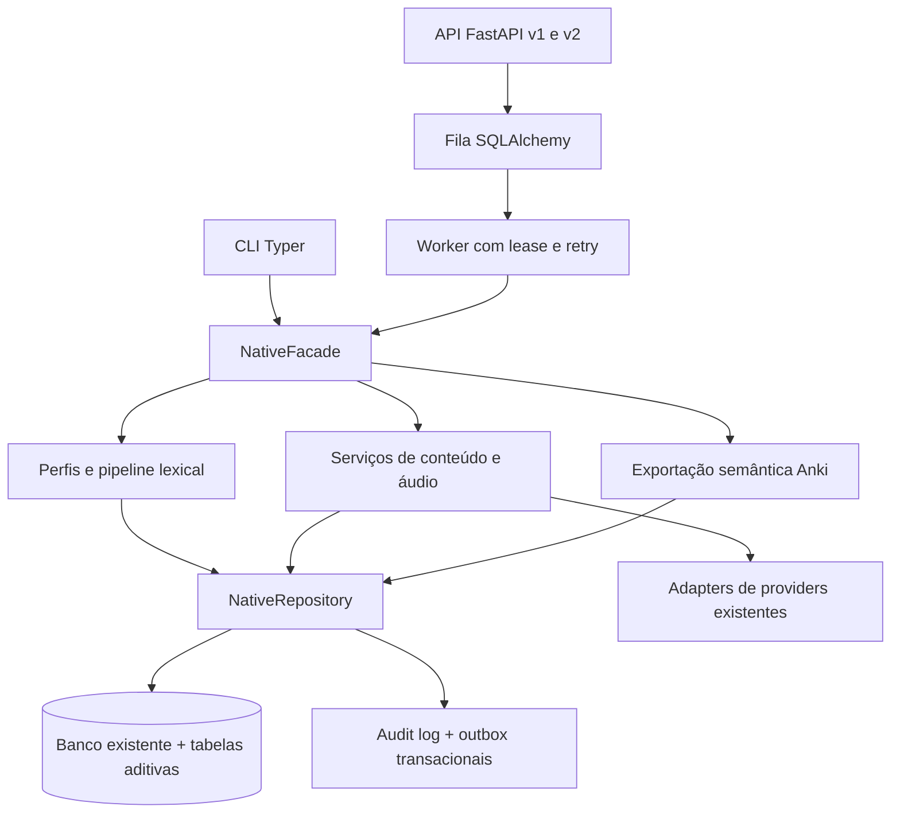

# Arquitetura nativa

A mudança evolui o pacote `src/multilang`; não cria outro aplicativo nem
substitui os exporters e os jobs antigos. A análise anterior à implementação
está em [roadmap-4-analysis.md](roadmap-4-analysis.md).

## Fronteiras

`domain/` contém contratos tipados, identidades e invariantes. `services/`
contém cálculo, importação, validação, geração e exportação. `repositories/`
persiste os fatos sem commit implícito; a aplicação controla sua transação.
`native_runtime.py` compõe esses serviços e usa o mesmo `Settings` e os mesmos
providers de `runtime.py`. A API, a CLI e os workers usam essa composição.

Core guarda identidades, revisões, formas, fontes, ranking e edições.
Generated guarda versões imutáveis de conteúdo e áudio. User guarda estado e
histórico minimizado por proprietário. A adaptação pode mudar prioridade,
módulo e elegibilidade; não muda GUID, rank nem conteúdo Core.

## Integração e extensibilidade

O `PluginRegistry` permite registro explícito de analyzers e importers por nome
e versão. Somente código/configuração de confiança pode registrar plugins;
nenhum payload pode importar módulos, executar scripts ou escolher endpoints.
Perfis desabilitados falham antes da geração ou importação. O analyzer
`source-evidence` consome análise explícita e não inventa lemas ou sentidos.

A fila usa o banco já existente, com chave de idempotência por proprietário,
claim compare-and-swap, lease, heartbeat, fencing, retry limitado e estado
terminal. A entrega é pelo menos uma vez; handlers precisam ser idempotentes.
Falhas após um efeito externo podem repetir chamadas de provider: aprovação de
custo e limites do provider continuam necessários.

Busca usa consultas parametrizadas, formas normalizadas, sentido, significado
gerado e filtros de frequência por dataset ativo. Cache local é limitado, tem
TTL e chave versionada/namespace. O áudio ainda verifica os bytes ao reutilizar
um asset. Não foram adicionados Redis/RQ ou Meilisearch: o banco já atende ao
escopo; esses adapters podem ser introduzidos se medições justificarem.

## Evidência e ativação

Receipts locais HMAC vinculam payload, finalidade, responsável e expiração.
O segredo fica na configuração do operador. Assinatura prova integridade e
origem da decisão, não a verdade das afirmações linguísticas. A revisão precisa
acontecer antes de assinar. Artefatos da decisão Anki também têm seus bytes
conferidos. Uma fixture com aprovação sintética nunca qualifica produção.

`ROADMAP_4_ENABLED` mantém o caminho nativo desligado por padrão. O startup
legado provisiona somente o schema legado; migration 20 exige o serviço de
migração autorizado. Toda capacidade linguística começa desabilitada.

## Observabilidade e segurança

API e worker emitem spans, métricas e logs estruturados com nomes fixos,
status e duração. Não registram payloads, credenciais ou stack traces contendo
entrada privada. O operador configura os providers/exporters OpenTelemetry.
A instrumentação sozinha não configura um backend externo de telemetria.

Credenciais HTTP configuradas mapeiam actor e papel; o cliente não fornece seu
próprio papel. Limites de requisição, rate limit, ownership, schemas fechados e
escaping protegem as fronteiras. A implantação deve fornecer TLS, egress e
armazenamento seguro dos segredos. Veja [API](api.md).
